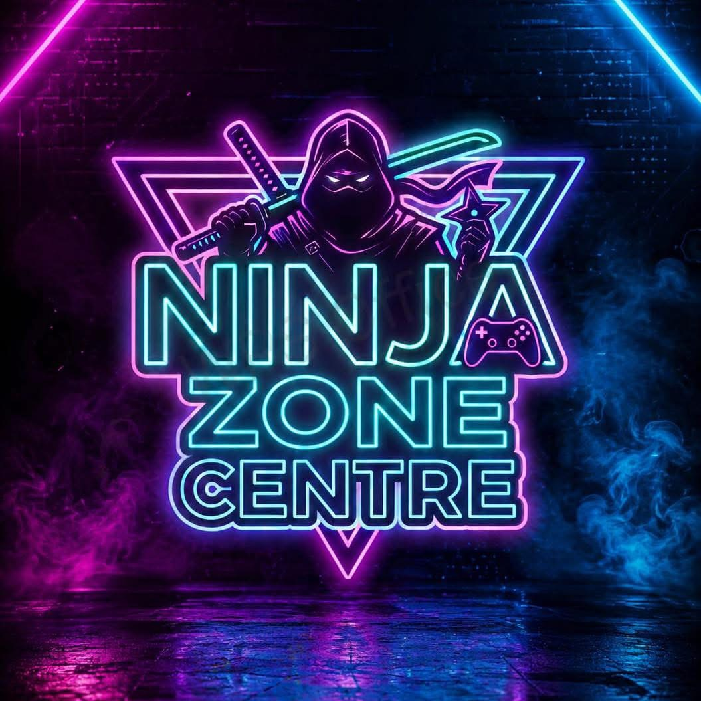

# 🎮 Ninja Zone Center

<div align="center">



**صالة الألعاب الإلكترونية الأولى في الرمادي**

[](LICENSE)
[](https://reactjs.org/)
[](https://www.typescriptlang.org/)
[](https://vitejs.dev/)

[🌐 زيارة الموقع](https://ninjazonecenter.netlify.app) · [📱 تواصل معنا](https://wa.me/9647844433345) · [📸 Instagram](https://instagram.com/ninjazonegc)

</div>

---

## 🌟 نظرة عامة

**Ninja Zone Center** هو موقع ويب حديث ومتجاوب بالكامل لأفضل صالة ألعاب إلكترونية في الرمادي، العراق. يوفر الموقع تجربة مستخدم احترافية مع تصميم Neon Gaming مميز وإمكانيات حجز إلكتروني متقدمة.

### ✨ المميزات الرئيسية

- 🎨 **تصميم Neon Gaming احترافي** - تصميم عصري بأسلوب الألعاب الإلكترونية
- 📱 **متجاوب بالكامل** - يعمل بسلاسة على جميع الأجهزة
- 🌐 **دعم كامل للعربية** - واجهة RTL مع خطوط عربية جميلة
- ⚡ **أداء فائق** - تحميل سريع وتجربة سلسة
- 🎯 **نظام حجز إلكتروني** - حجز الجلسات أونلاين بسهولة
- 📢 **عرض إعلانات ديناميكي** - نظام carousel للإعلانات الترويجية
- 🔍 **محسّن لمحركات البحث** - SEO متقدم مع Open Graph
- 🎪 **معرض صور تفاعلي** - عرض صور الصالة بطريقة احترافية
- 📍 **خرائط تفاعلية** - موقع الصالة على Google Maps
- 💬 **تكامل واتساب** - زر عائم للتواصل السريع

---

## 🛠️ التقنيات المستخدمة

### Frontend Framework
- **React 19.2.0** - مكتبة واجهة المستخدم
- **TypeScript 5.8.3** - للكتابة الآمنة للأنواع
- **Vite 7.3.3** - أداة البناء السريعة
- **TanStack Router** - التوجيه المتقدم
- **TanStack Query** - إدارة البيانات والحالة

### Styling & UI
- **Tailwind CSS 4.2.1** - إطار عمل CSS الحديث
- **Radix UI** - مكونات واجهة المستخدم
- **Lucide React** - أيقونات SVG حديثة
- **Framer Motion** - حركات وانتقالات سلسة

### Form & Validation
- **React Hook Form** - إدارة النماذج
- **Zod** - التحقق من صحة البيانات

### Additional Libraries
- **date-fns** - معالجة التواريخ
- **Recharts** - رسوم بيانية تفاعلية
- **Sonner** - إشعارات Toast جميلة

---

## 🚀 البدء السريع

### المتطلبات الأساسية

- Node.js 20 أو أحدث
- npm أو yarn أو bun

### التثبيت

```bash
# استنساخ المستودع
git clone https://github.com/ahmadalrifaie8-sudo/ni.git

# الانتقال إلى مجلد المشروع
cd ni

# تثبيت الحزم
npm install

# تشغيل المشروع محلياً
npm run dev
```

الموقع سيعمل على: **http://localhost:5173**

---

## 📦 الأوامر المتاحة

```bash
# تشغيل خادم التطوير
npm run dev

# بناء المشروع للإنتاج
npm run build

# معاينة البناء
npm run preview

# فحص الأخطاء
npm run lint

# تنسيق الكود
npm run format
```

---

## 🌐 النشر على Netlify

### الطريقة الأولى: النشر المباشر

```bash
# تثبيت Netlify CLI
npm install -g netlify-cli

# تسجيل الدخول
netlify login

# بناء المشروع
npm run build

# نشر المشروع
netlify deploy --prod
```

### الطريقة الثانية: الربط مع GitHub

1. رفع المشروع على GitHub
2. الذهاب إلى [Netlify Dashboard](https://app.netlify.com)
3. اختيار "Add new site" → "Import an existing project"
4. ربط المستودع من GitHub
5. الإعدادات ستطبق تلقائياً من `netlify.toml`

---

## 📁 هيكل المشروع

```
ninja-zone-center/
├── public/              # الملفات العامة
│   └── ads/            # صور الإعلانات
├── src/
│   ├── assets/         # الصور والملفات الثابتة
│   ├── components/     # المكونات القابلة لإعادة الاستخدام
│   │   ├── ui/        # مكونات واجهة المستخدم
│   │   └── LogoAdsCarousel.tsx
│   ├── hooks/          # React Hooks مخصصة
│   ├── lib/            # وظائف مساعدة
│   ├── routes/         # صفحات التطبيق
│   │   ├── __root.tsx
│   │   └── index.tsx
│   ├── styles.css      # الأنماط العامة
│   └── entry-client.tsx
├── index.html
├── vite.config.ts
├── netlify.toml        # إعدادات Netlify
└── package.json
```

---

## 🎯 الميزات التفصيلية

### 🏠 الصفحة الرئيسية
- Hero section مع نظام carousel للشعار والإعلانات
- عرض الشعار لمدة 4 ثواني ثم الانتقال للإعلانات
- انتقالات سلسة بين الإعلانات

### 📖 عن الصالة
- معلومات شاملة عن المركز
- عرض المميزات الرئيسية مع أيقونات

### 🎮 الخدمات
- بطاقات تفاعلية للخدمات
- أيقونات ووصف لكل خدمة

### 📅 نظام الحجز
- نموذج حجز إلكتروني متكامل
- اختيار التاريخ والوقت
- التحقق من صحة البيانات

### 🏆 البطولات
- عرض البطولات القادمة
- معلومات تفصيلية عن كل بطولة

### 🖼️ المعرض
- معرض صور تفاعلي
- عرض صور الصالة بجودة عالية

### 📍 الموقع
- خريطة Google Maps تفاعلية
- معلومات الاتصال والعنوان

### 💬 التواصل
- زر واتساب عائم
- نموذج اتصال
- روابط وسائل التواصل الاجتماعي

---

## 🎨 التخصيص

### تغيير الألوان

الألوان معرّفة في `src/styles.css`:

```css
:root {
  --neon-pink: oklch(0.78 0.18 320);
  --neon-cyan: oklch(0.78 0.18 195);
  --neon-purple: oklch(0.68 0.24 300);
  /* ... المزيد */
}
```

### إضافة إعلانات جديدة

1. ضع الصور في `public/ads/`
2. حدّث المصفوفة في `src/components/LogoAdsCarousel.tsx`:

```typescript
const ads = [
  "/ads/1 (1).png",
  "/ads/1 (2).png",
  // أضف صورك هنا
];
```

---

## 🔒 الأمان

- ✅ لا توجد مفاتيح API مكشوفة
- ✅ التحقق من صحة المدخلات
- ✅ حماية من XSS
- ✅ HTTPS في الإنتاج

---

## 📞 التواصل والدعم

### Ninja Zone Center
- 📱 واتساب: [+964 784 443 3345](https://wa.me/9647844433345)
- 📸 Instagram: [@ninjazonegc](https://instagram.com/ninjazonegc)
- 📍 الموقع: الرمادي، العراق

### تطوير المشروع
**مركز الرؤية للابتكار الرقمي - The Vision Digital Innovation Center**
- 🌐 متخصصون في تطوير الحلول الرقمية المتكاملة

---

## 📝 الترخيص

هذا المشروع مرخص تحت رخصة MIT - راجع ملف [LICENSE](LICENSE) للتفاصيل.

---

## 🙏 الشكر والتقدير

شكر خاص لـ:
- فريق React على المكتبة الرائعة
- مجتمع Tailwind CSS
- جميع المساهمين في المكتبات مفتوحة المصدر المستخدمة

---

## 🔮 الخطط المستقبلية

- [ ] تطبيق موبايل (React Native)
- [ ] نظام نقاط الولاء
- [ ] بوابة دفع إلكتروني
- [ ] نظام إدارة البطولات
- [ ] دردشة مباشرة
- [ ] تطبيق PWA

---

<div align="center">

**صُنع بـ ❤️ بواسطة مركز الرؤية للابتكار الرقمي**

⭐ إذا أعجبك المشروع، لا تنسَ إعطاءه نجمة!

</div>
